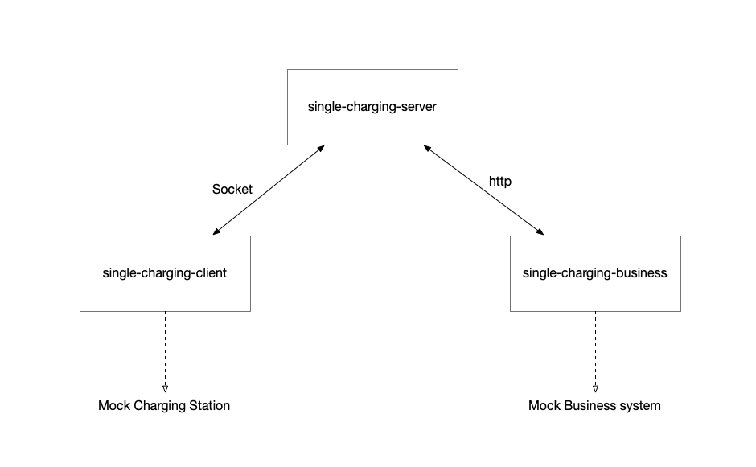
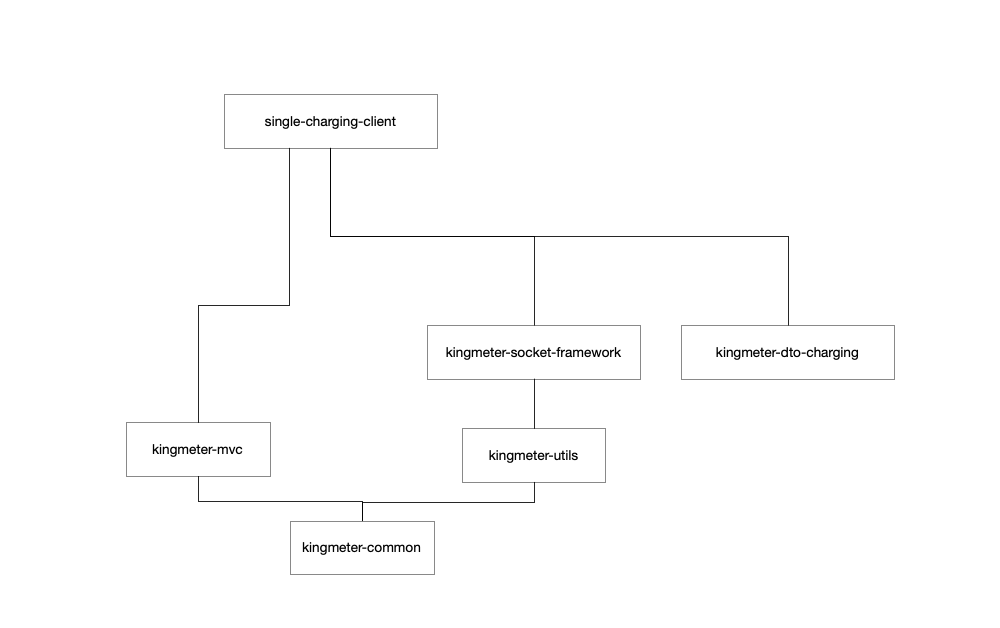
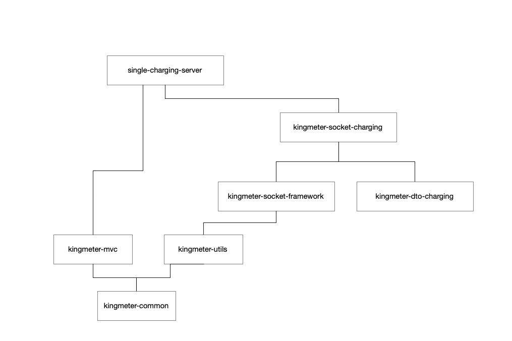
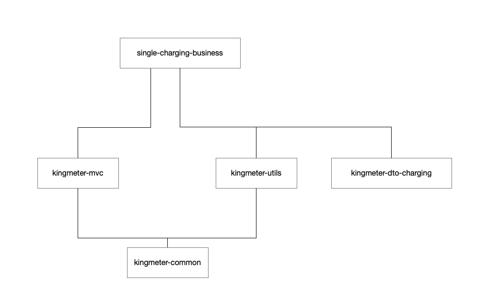
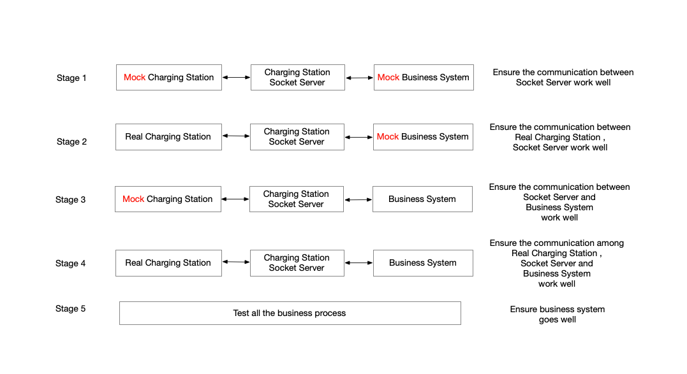

# Description of the underlying framework of the server corresponding to the new version of the charging pile

## I.Introduction

###1.Research Background and Significance
​	After years of developing technology, our company has organized a number of technical engineers to continuously improve and optimize electric bicycle charging pile products step by step. In the process of technical assistance and cooperation with various customer companies, we have taken many detours and summed up a lot of valuable experience. To this end, we have specially developed a server communication framework for the new version of the charging pile (with OTA upgrade function), which is convenient for the customer technical team to seamlessly connect our charging pile products.
## II.System Related Technologies
###1.Netty Technology
​	Since the communication between the charging pile wifimaster and the server uses the socket protocol, we use the mature netty framework in the java system on the server side to handle the functions of receiving messages and issuing instructions.
###2.Spring Boot
​	Spring Boot realizes automatic configuration, reduces the complexity of project construction, and it can integrate tomcat to provide external web services. It is the most popular web framework technology in java web.
###3.ELK
​	We used logback in the project to add log anchors for each logical key position, especially the content of hardware and server communication, which were recorded in different categories; then stored in elasticsearch through logstash, and finally viewed by using kibana. Then we will attach the log parsing configuration file for the customer convenience.
## III.System Design
###1.Architecture design

​	We divide the system into three subsystems :

###2.single-charging-client
​	Simulate charging pile hardware to realize all protocol contents.

​	This system is directly built on the kingmeter-socket-framework, loaded with socket client and web server, and the user requests the http interface provided by postman to simulate the operation of the physical hardware of the charging pile, such as scanning the code to rent a bicycle, the bicycle enters the pile, and fault reporting, etc. This module is designed to test the connectivity and logical correctness of single-charging-server and single-charging-business.
###3.single-charging-server

​	The server program for docking the charging pile hardware includes socket server and web server. The socket server is mainly for docking the charging pile system, and the web server is mainly for docking the business system. The integrated web server here is mainly used to receive the instructions of the business system. Of course, we can use Message Queue, grpc and other technologies to achieve this communication, which can be modified according to customer ideas.

​	We mainly explain single-charging-server, and the other two systems are auxiliary systems. In actual operation, they are replaced by the real charging pile wifimaster and the customer's real business operation system.

​	The single-charging-server is based on netty and spring boot, and it provides both socket services and web services. We split it into kingmeter-dto, kingmeter-dto-charging, kingmeter-utils, kingmeter-socket-framework, kingmeter-socket-charging, and single-charging-server. Modules have forward and backward dependencies.

​	Based on the principle of kiss (keep it stupid simple), we try to make the server's communication module light and thin without participating in any business logic, but as a tool for transparent data transmission to increase its robustness and stability.

###4.single-charging-business
​	Simulate the business system (user,money,order,trip and other business logic), and it sends commands such as rental order to the single-charging-server

## IV.System Implementation
###1.kingmeter-common
​	Error, log anchor, http return, code collection, application context management
###2.kingmeter-dto-charging
​	This module mainly encapsulates the data model of the round-trip communication between the charging pile and the server.
####	com.kingmeter.dto.charging.latest: 
​	it is the new version of the charging pile (with ota) communication data model package
####	com.kingmeter.dto.charging.old:
​	it is the old version of the charging pile (without ota) communication data model package
###3.kingmeter-utils 
​	enumeration type, utility class
###4.kingmeter-socket-framework
​	The socket core tool “module” encapsulates the server program as the underlying code of the server side and the simulated test client side, including encoding and decoding, device information management, etc. The contents of the package are explained in turn as follows:
####application : 
​	The socket command is sent, and the information reported by the charging pile is obtained by polling.

####business : 
​	Process the information reported by the iot device, and dispatch the information to the business processing class RequestStrategy (kingmeter-socket-charging will implement the RequestStrategy interface, and the strategy mode is used here).

####codec :
​	The communication between the iot device and the server is based on a set of custom codec protocols in the form of fixed-length messages. When decoding, the received byte stream is unpacked, and the byte array corresponding to a complete message is passed to the ClientHandler or ServerHandler under the role package for processing. When encoding, the ResponseBody is encoded into the byte stream required for communication and sent out by the SocketChannel.
####config :
​	According to the custom codec protocol, the content at the beginning of the message, the content at the end, and the length of the message are obtained from the configuration file, so that it can be configured flexibly, because our company not only has charging piles, but also intelligent horseshoe locks. Front mortise lock and single iron stake are all built on this module, and kingmeter-socket-charging is just one of them.
####dto:
​	It is mainly the base class that encapsulates the interaction data model between iot devices and servers. Based on this module, the upper-level modules such as kingmeter-socket-charging will be parsed into different data model implementations according to different function codes.
####idletrigger :
​	The netty server or client will monitor the message sent by the other end, and every time a message is received, it will restart the timing. If the other party's information is not received in particular period, it is considered that the other party is disconnected and will force the communication of the other party to be disconnected.
####role : 
​	It is divided into two roles: client and server. Client is mainly used by the underlying framework package used when the upper layer is implemented as the client side, and server is used by the server side. The respective ChannelInitializer will be configured with idleTiger, codec, and business handler implementation. .
####strategy :
​	Strategy pattern parent class which is mainly used to forward the message to the specific business layer after receiving it.

####util : 
​	CacheUtil mainly caches the hardware information that has been connected, because these hardware information will only have meaning when the connection between the two parties is successful, and in order to ensure the speed of reading and writing, it can only be stored in memory, no need to persist into a hard disk or database. Of course, the business system can back up a copy of the corresponding information at the same time, which is convenient for the business management system to query and use.
###5.kingmeter-socket-charging
​	Based on kingmeter-socket-framework, it is implemented for charging piles. Parallel to this module and modules similar to kingmeter-socket-smartlock, kingmeter-socket-frontlock, etc. can be implemented.
####acl : 
​	acl is the abbreviation of Anticorruption Layer. It borrows the concept of domain driven design and is mainly used to isolate the underlying communication and business logic, so that all parties do not interfere with each other and achieve isolation and decoupling.
####Business:
​	code : 	

​			Established according to the function code calibrated on the charging pile tcp communication protocol document.

​	stragegy : 	

​			All classes in this package implement RequestStrategy, and each function code has 	a corresponding specific implementation. This is the embodiment of the strategy pattern.

​	tracker :	 

​			This is used for ota remote upgrade. We implement ota remote upgrade. 

​	The steps are as follows:

​	A. The server sends an instruction to query the bicycle information to the charging pile

​	B. The server receives the pile bicycle information reported by the charging pile and triggers C 

​	C. The server sends remote upgrade instructions

​	D. The server receives the charging upgrade confirmation message

​	E. After the charging pile self-upgrades, it will automatically power off and restart, and will report the login request

​	F. The server receives the login request and checks whether there is an upgrade command for the charging pile before, and if so, it will actively trigger G

​	G. The server sends the command to query the bicycle information to the charging pile again

​	H.The server receives the bicycle information reported by the charging pile , compares it with the information received by B, and finally notifies the business management system of the comparison result.

####utils : 
​	The worker is mainly responsible for forwarding messages received by the server to 	specific business implementations (classes in the stragey package).
####rest: 
​	The encapsulation server sends instructions to shield the details of the byte stream. The upper-layer logic only needs to send the model data, and it also includes synchronously waiting for the return result of the charging pile within the set timeout period.
###6.single-charging-server
​	This project is built on kingmeter-socket-charging, loaded with socket server and web server, and can also determine whether it is a stand-alone test mode or a connection business system mode according to kingmeter.requestBusiness in the configuration file. BusinessServiceImpl communicates with the business system through http. In order to simplify, this project does not add permission control for the http service. If necessary, it can be extended by itself. However, when requesting the business system, we can add a mutually agreed token to the request message header.

​	In practical applications, the operator can rewrite the project according to its own architectural characteristics, and use in-process communication in the business system to access the underlying framework provided by the kingmeter-socket-charging. Of course, the project can also be improved, combining the business system with this method. The project is isolated and the inter-process communication method is used to achieve the purpose of high cohesion and low coupling.

###7.Communication between subsystems
​	The existence of the two subsystems single-charging-client and single-charging-business is only to verify the feasibility and stability of the single-charging-server system and the underlying socket server. In actual production, these two subsystems must be replaced, and the single-charging-server can also choose whether to improve or cancel it according to the specific situation of the autonomous software system and directly connect to kingmeter-socket-charging.

​	During the test, the communication between the three subsystems uses the http protocol, and the specific communication content can be found in the relevant code. Moreover, if they are all deployed on the same server or different servers in the same LAN, the http performance will not become the bottleneck of data flow.

​	Obviously, in order to pursue the ultimate performance in the actual operating environment, it is the best for the business system to directly access kingmeter-socket-charging, but this will also slightly increase the system complexity. It is recommended not to do this in the early stage of system access. To achieve the purpose of system decoupling, it is acceptable to lose a little performance, especially when the site equipment does not reach the level of more than 10,000.

## V.System Test
​	When we connect the hardware system and the business system, we divide the process into many stages to ensure that each step goes smoothly, and the current step is the guarantee prerequisite for the next step. Please try to follow the steps as much as possible. Although the process will be a little tedious, it is still necessary for troubleshooting. Otherwise, if you start debugging as a whole, once a fault occurs, troubleshooting will be a headache.

​	Regarding the stress test, single-charging-client can configure the number of simulated devices in the configuration, and users can configure the number of charging pile sites by themselves.
## VI.Conclusion and Outlook
​	We can use a variety of programming languages to build a socket server. In the java system, Netty provides an asynchronous, event-driven network application framework and tools to rapidly develop high-performance, high-reliability network servers and client programs. Of course, customer can also use python's tornado for socket server development.

​	Anyway, they are all communication development based on tcp/ip protocol. Please pay carefully attention to the following points:

​		A. Sticky packet unpacking processing. The instability of the network may cause the packet information to be incomplete or extra. We use the sequence of tcp messages to achieve unpacking processing.

​		B. Modify the number of file handles in the linux system. By default, the linux system accepts a maximum of 1024 socket connections for a process. Obviously, this needs to be adjusted.

​		C.Select and Epoll selection, using Epoll when the device connection increases a lot, the performance will not decrease much.

​		D. For example, a sudden power failure, or when the network signal quality is poor for a long time, the iot device is likely to be passively disconnected from the network. At this time, the server does not know that the device is disconnected, so it can only be connected by attaching a timer to each connection. When there is a message communication, it will be reset to 0, and then the time will be accumulated. After the timeout, it is determined that the iot device has been disconnected, and the connection here is actively disconnected, and then the business system is notified.

​		E. When running a socket server, it is necessary to monitor the memory and cpu usage of the server to ensure that the server can run normally and stably.

​		F. Flow Control

## VII.Appendix File
A. logstash configuration file
B. postman config file
